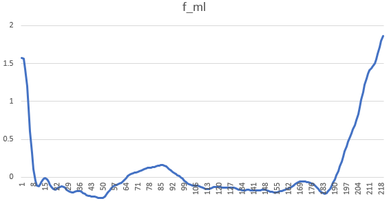
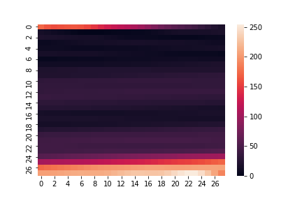

# Signal-to-image
Signal-to-image experimental approch

Process
Read Data -> Slice by ...(peak) -> resampling to 784 x axis data -> reshape to 28*28
plot 

# Example

Change 218 x axis cells data to 28*28 img (Same as mnist format)

